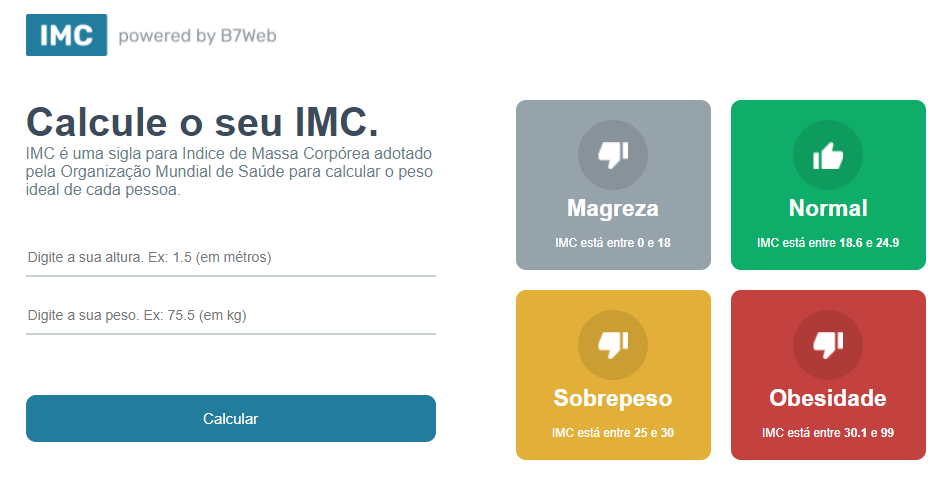

<h1 style="text-align:center">Calculadora de IMC</h1>
<br>
<div align="center">
    
    
    
</div>
<br>

<div align="center">
    
</div>

<div align="center">
    <a href="#sobre">Sobre</a> | 
    <a href="#run">Rodando o projeto</a>
</div>

<a id="sobre"></a>

## 🍓 Sobre

Uma Calculadora de IMC funcional feita com react

**_Projeto do curso da B7web_**

## :running: Rodando o projeto

### 📂 Rodando através da fonte.

#### 1. Pré-requisitos:

- **[Node.js](https://nodejs.org/en/)**, **[Git](https://git-scm.com/)** e um gerenciador de pacotes (**[NPM](https://www.npmjs.com/)** ou **[Yarn](https://yarnpkg.com/)**) instalados na máquina.

#### 2. Instalando dependências

```bash
$ npm install
# ou
$ yarn install
```

#### 3. Iniciando

```bash
$ npm run start
# ou
$ yarn start
```

### 🔖 Licença

Caso queira conferir a licença do projeto, só olhar esse arquivo [LICENSE](./LICENSE)